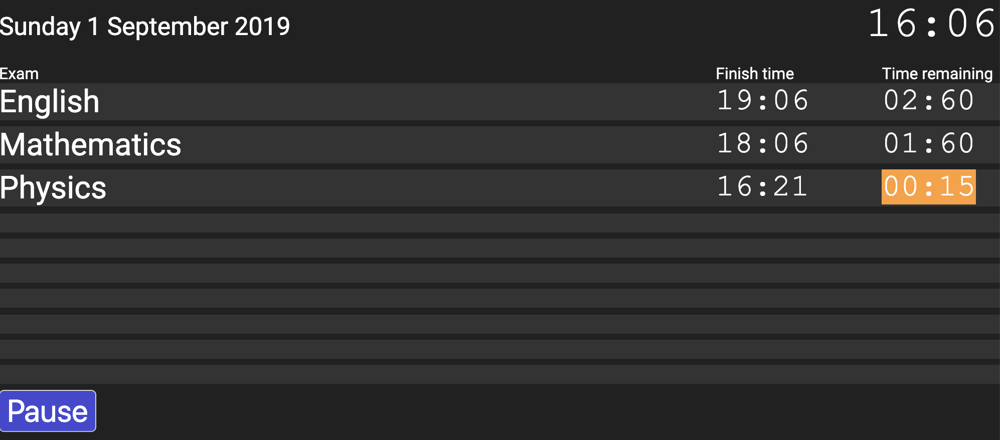

# Examinations timer

A simple HTML+Javascript+CSS tool that can be used to display exam timing information to invigilators and candidates. I wrote this to replace the "impossible to read whiteboard at the front of a hall" that schools seem to continue to use.

---

Time remaining will be highlighted in orange at less than 30 minutes, and in red at less than 5 minutes remaining.

## Available online

* [https://paulbaumgarten.github.io/examinations-timer-js/index.html](https://paulbaumgarten.github.io/examinations-timer-js/index.html)

## Desktop alternative

I have a Python alternative that is very similar in function if you prefer a desktop app.

* [https://github.com/paulbaumgarten/examinations-timer](https://github.com/paulbaumgarten/examinations-timer).

